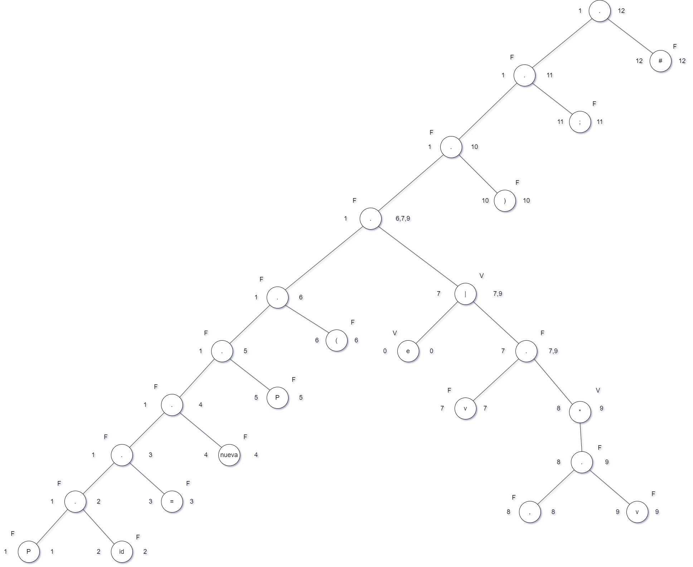
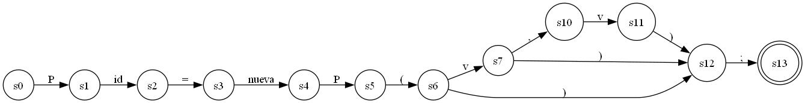

# MANUAL TECNICO

## TABLA DE TOKENS

| Token             | lexema            | Patrón                    |
|-------------------|-------------------|---------------------------|
| reservada         | CrearBD           | $(A-Z)(a-z)^{+}(A-Z)^{+}$ |
| reservada         | EliminarBD        | $(A-Z)(a-z)^{+}(A-Z)^{+}$ |
| reservada         | CrearColeccion    | $(A-Z)(a-z)^{+}$          |
| reservada         | EliminarColeccion | $(A-Z)(a-z)^{+}$          |
| reservada         | InsertarUnico     | $(A-Z)(a-z)^{+}$          |
| reservada         | ActualizarUnico   | $(A-Z)(a-z)^{+}$          |
| reservada         | EliminarUnico     | $(A-Z)(a-z)^{+}$          |
| reservada         | BuscarTodo        | $(A-Z)(a-z)^{+}$          |
| reservada         | BuscarUnico       | $(A-Z)(a-z)^{+}$          |
| nueva             | nueva             | $(a-z)^{+}$               |
| valor             | valor             | " ( [ ^ " ] * )"          |
| identificador     | identificador     | $(a-z)^{+}$               |
| igual             | =                 | =                         |
| abre parentesis   | (                 | (                         |
| cierra parentesis | )                 | )                         |
| separador         | ,                 | ,                         |
| fin sentencia     | ;                 | ;                         |

Nota: recordemos que la notación " ( [ ^ " ] * ) " quiere decir guardará cero o más veces cualquier valor que sea diferente de las comillas dobles, iniciará a capturar la cadena desde la comilla doble y cuando venga una comilla doble nuevamente dejará de capturar.

## METODO DEL ARBOL

Luego de haber realizado el arbol procedemos a tabular la información, la tabla izquierda es en la inicialmente transcribo los resultados de los siguientes de mi arbol

la tabla del centro es en que creo estados que no existen, como el estado (7,10) y el estado (8,10), esto se hace para evitar que el AFD se convierta en un AFN.

Y por último en la tabla de la derecha cambio el nombre de los estados y determino mis estados finales, resaltados en morado hay 2 estados que no producen ningún tipo de resultado, por lo cual los eliminé del automata final, ya que el automata generado por el método del arbol me generó estados por si quisiera pasar más de 2 argumentos dentro de los parentesis.

## AUTOMATA FINITO DETERMINISTA

El automata generado con la tabla final ( donde renombré los estados con simbología $s_i$ ) fue:

## GRAMATICA LIBRE DE CONTEXTO

| No terminal |    | Producción       |
|-------------|----|------------------|
| S           | -> | E                |
| E           | -> | P I = E          |
| E           | -> | nueva P ( T ) ;  |
| T           | -> | V T              |
| T           | -> | , T              |
| T           | -> | ε                |
| P           | -> | reservada        |
| I           | -> | identificador    |
| V           | -> | valor            |

## EXPLICACIÓN DEL CÓDIGO

